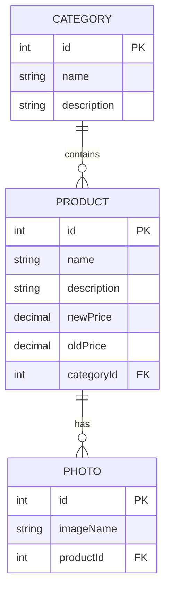

# AmazonY App - .NET 8 & Angular E-Commerce Platform

> A full-stack e-commerce application built with **ASP.NET Core 8** backend and **Angular** frontend, featuring a modern architecture with Entity Framework Core, AutoMapper, and a clean separation of concerns.

---

## 🎯 Status & Badges


---

## 📚 Tech Stack

### Backend
- **Framework**: ASP.NET Core 8 (Web API)
- **Language**: C# 12+
- **Database ORM**: Entity Framework Core 8.0.23
- **Database**: SQL Server
- **Mapping**: AutoMapper 16.1.1
- **API Documentation**: Swagger/OpenAPI (Swashbuckle 6.6.2)
- **Dependency Injection**: Built-in .NET Core DI Container
- **File Management**: Physical File Provider

### Frontend
- **Framework**: Angular (v17+)
- **TypeScript**: Latest
- **Node.js**: v18+ LTS

### Infrastructure & Architecture
- **Design Pattern**: Clean Architecture (Layered)
- **API Pattern**: Repository Pattern with Unit of Work
- **Authentication**: Scoped services for connection channels
- **CORS**: Enabled for Angular frontend (localhost:4200)
- **Caching**: In-Memory Cache Support

---

## 🏗️ Project Architecture

The solution follows a **three-tier clean architecture**:

```
AmazonY/
├── AmazonY.API/              # Presentation Layer (REST API)
│   ├── Controllers/          # API endpoints
│   ├── Middleware/           # Custom middleware (Exception handling, etc.)
│   ├── Mapping/              # AutoMapper profiles
│   ├── Helper/               # Utility classes
│   ├── wwwroot/              # Static files & images
│   └── Program.cs            # Application startup & DI configuration
│
├── AmazonY.Core/             # Business Logic Layer
│   ├── Entities/             # Domain models (Category, Product, Photo)
│   ├── DTO/                  # Data Transfer Objects
│   ├── Interfaces/           # Repository & Service interfaces
│   ├── Services/             # Business logic services
│   └── Sharing/              # Shared models & enums
│
└── AmazonY.Infrastructure/   # Data Access Layer
    ├── Data/                 # DbContext, migrations, configurations
    ├── Repositories/         # Repository implementations
    ├── Service/              # Infrastructure services (Image management)
    └── InfrastructureRegistration.cs  # DI service registration
```

---

## 🎁 Key Features

### E-Commerce Core Functionality
- ✅ **Product Management**: Create, Read, Update, Delete (CRUD) operations
- ✅ **Category Management**: Organize products by categories
- ✅ **Product Photos**: Support for multiple images per product
- ✅ **Pagination**: Efficient data retrieval with page-based pagination
- ✅ **Price Tracking**: Support for old and new prices
- ✅ **Image Management**: Built-in image storage and retrieval service

### Technical Highlights
- ✅ **Async/Await Pattern**: All operations are non-blocking and scalable
- ✅ **Error Handling**: Centralized exception middleware
- ✅ **Dependency Injection**: Full DI container with scoped service lifetime
- ✅ **Auto-Mapping**: Automatic DTO ↔ Entity mapping with AutoMapper
- ✅ **Unit of Work Pattern**: Transactional consistency across repositories
- ✅ **Swagger API Documentation**: Interactive API explorer built-in
- ✅ **CORS Support**: Seamless Angular frontend integration
- ✅ **Database Migrations**: Entity Framework Core code-first migrations

---

## 📊 Entity Relationship Diagram (ERD)



**Database Schema Overview:**
- **Categories Table**: Stores product categories with metadata
- **Products Table**: Stores product details including pricing and category reference
- **Photos Table**: Stores image references for each product with one-to-many relationship

---

## 🚀 Getting Started

### Prerequisites

Ensure you have the following installed:

| Component | Version | Download |
|-----------|---------|----------|
| **.NET SDK** | 8.0+ | [Download](https://dotnet.microsoft.com/download) |
| **SQL Server** | 2019+ | [Download](https://www.microsoft.com/sql-server) |
| **Visual Studio** | 2022+ | [Download](https://visualstudio.microsoft.com) |
| **Visual Studio Code** | Latest | [Download](https://code.visualstudio.com) |
| **Node.js** | 18+ LTS | [Download](https://nodejs.org) |
| **Angular CLI** | 17+ | `npm install -g @angular/cli` |

### Installation Steps

#### 1️⃣ Clone the Repository

```bash
git clone https://github.com/Salahalfeqy/AmazonY-App-.NET-8-With-Angular.git
cd AmazonY-App-.NET-8-With-Angular
```

#### 2️⃣ Configure Database Connection

Edit `AmazonY.API/appsettings.json` and update the connection string:

```json
{
  "ConnectionStrings": {
    "AmazonYDataBase": "Server=YOUR_SERVER;Database=AmazonYDb;Trusted_Connection=True;TrustServerCertificate=True"
  }
}
```

**For local SQL Server Express:**
```
Server=.;Database=AmazonYDb;Trusted_Connection=True;TrustServerCertificate=True
```

#### 3️⃣ Restore NuGet Dependencies

```bash
# Navigate to the API project
cd AmazonY.API
dotnet restore
```

#### 4️⃣ Apply Database Migrations

```bash
# From the AmazonY.API directory
dotnet ef database update --project ../AmazonY.Infrastructure
```

Or using Package Manager Console in Visual Studio:
```powershell
Update-Database -Project AmazonY.Infrastructure
```

#### 5️⃣ Run the Backend API

```bash
dotnet run
# API will start on: https://localhost:5001
# Swagger UI: https://localhost:5001/swagger
```

#### 6️⃣ Configure and Run the Angular Frontend

```bash
# Navigate to the Angular project (create if needed)
cd ../AmazonY-Frontend
npm install
ng serve
# Frontend will run on: http://localhost:4200
```

---

## ⚙️ Environment Variables

Create an `appsettings.Development.json` file with the following configuration:

| Variable | Type | Required | Example Value | Description |
|----------|------|----------|---|---|
| `ConnectionStrings:AmazonYDataBase` | string | ✅ | `Server=.;Database=AmazonYDb;Trusted_Connection=True;TrustServerCertificate=True` | SQL Server connection string |
| `Logging:LogLevel:Default` | string | ✅ | `Information` | Default logging level |
| `Logging:LogLevel:Microsoft.AspNetCore` | string | ✅ | `Warning` | ASP.NET Core logging level |
| `AllowedHosts` | string | ✅ | `*` | Allowed host headers |
| `CORS:AllowedOrigins` | string | ✅ | `https://localhost:4200` | Angular app origin for CORS |

**Sample `appsettings.Development.json`:**

```json
{
  "Logging": {
    "LogLevel": {
      "Default": "Information",
      "Microsoft.AspNetCore": "Warning"
    }
  },
  "AllowedHosts": "*",
  "ConnectionStrings": {
    "AmazonYDataBase": "Server=.;Database=AmazonYDb;Trusted_Connection=True;TrustServerCertificate=True"
  }
}
```

---

## 🔗 API Endpoints

### Base URL
```
https://localhost:5001/api
```

### Categories Endpoints

| Method | Endpoint | Description | Request Body |
|--------|----------|-------------|---|
| `GET` | `/categories/get-all` | Get all categories | - |
| `GET` | `/categories/get-by-id/{id}` | Get category by ID | - |
| `POST` | `/categories/add-category` | Create new category | `CategoryDTO` |
| `PUT` | `/categories/update-category` | Update category | `UpdateCategoryDTO` |
| `DELETE` | `/categories/delete-category` | Delete category by ID | Query: `id` |

**CategoryDTO Structure:**
```json
{
  "name": "Electronics",
  "description": "Electronic devices and gadgets"
}
```

### Products Endpoints

| Method | Endpoint | Description | Request Body |
|--------|----------|-------------|---|
| `GET` | `/products/get-all` | Get all products (paginated) | Query params: `pageNumber`, `pageSize` |
| `GET` | `/products/get-by-id/{id}` | Get product by ID | - |
| `POST` | `/products/Add-Product` | Create new product | `AddProductDTO` |
| `PUT` | `/products/Update-Product/{id}` | Update product | `UpdateProductDTO` |
| `DELETE` | `/products/Delete-Product/{id}` | Delete product by ID | - |

**AddProductDTO Structure:**
```json
{
  "name": "Laptop",
  "description": "High-performance laptop",
  "newPrice": 999.99,
  "oldPrice": 1299.99,
  "categoryId": 1
}
```

**UpdateProductDTO Structure:**
```json
{
  "id": 1,
  "name": "Laptop Pro",
  "description": "Updated description",
  "newPrice": 899.99,
  "oldPrice": 1299.99,
  "categoryId": 1
}
```

**Pagination Query Example:**
```
GET /products/get-all?pageNumber=1&pageSize=10
```

### Error Responses

All endpoints return standardized error responses:

```json
{
  "statusCode": 400,
  "message": "Error description",
  "data": null
}
```

Common Status Codes:
- `200 OK` - Successful request
- `400 Bad Request` - Invalid data or operation failed
- `404 Not Found` - Resource not found
- `500 Internal Server Error` - Server error

---

## 🔧 Development Guide

### Project Structure Explanation

#### AmazonY.API
- **Controllers**: REST API endpoints handling HTTP requests
- **Middleware**: Cross-cutting concerns (exception handling, logging)
- **Mapping**: AutoMapper profiles for DTO ↔ Entity transformations
- **Helper**: Utility classes and extension methods
- **wwwroot**: Static files, images, and frontend assets

#### AmazonY.Core
- **Entities**: Domain models representing database tables
- **DTO**: Data Transfer Objects for API contracts
- **Interfaces**: Repository and Service interfaces (contracts)
- **Services**: Business logic implementation
- **Sharing**: Shared models, enums, and constants

#### AmazonY.Infrastructure
- **Data**: Entity Framework Core DbContext, migrations, and entity configurations
- **Repositories**: Data access implementations
- **Service**: Infrastructure-specific services (ImageManagementService)
- **InfrastructureRegistration**: Dependency injection configuration

### Adding a New Feature

1. **Create Domain Entity** in `AmazonY.Core/Entities`
2. **Create DTOs** in `AmazonY.Core/DTO`
3. **Define Interfaces** in `AmazonY.Core/Interfaces`
4. **Implement Repository** in `AmazonY.Infrastructure/Repositories`
5. **Create AutoMapper Profile** in `AmazonY.API/Mapping`
6. **Create API Controller** in `AmazonY.API/Controllers`
7. **Add DbSet** to `AppDbContext`
8. **Create Migration** and update database

### Running Migrations

```bash
# Add a new migration
dotnet ef migrations add MigrationName --project AmazonY.Infrastructure

# Update database
dotnet ef database update --project AmazonY.Infrastructure

# Revert last migration
dotnet ef database update PreviousMigrationName --project AmazonY.Infrastructure

# Generate migration script
dotnet ef migrations script --project AmazonY.Infrastructure
```

---

## 📦 Dependencies

### NuGet Packages

```xml
<!-- AmazonY.API -->
AutoMapper 16.1.1
Microsoft.EntityFrameworkCore.Design 8.0.23
Swashbuckle.AspNetCore 6.6.2

<!-- AmazonY.Infrastructure -->
AutoMapper 16.1.1
Microsoft.EntityFrameworkCore 8.0.23
Microsoft.EntityFrameworkCore.Design 8.0.23
Microsoft.EntityFrameworkCore.SqlServer 8.0.23
Microsoft.EntityFrameworkCore.Tools 8.0.23
Microsoft.Extensions.FileProviders.Abstractions 8.0.0
Microsoft.Extensions.FileProviders.Physical 8.0.0

<!-- AmazonY.Core -->
Microsoft.AspNetCore.Http 2.3.9
Microsoft.AspNetCore.Http.Abstractions 2.3.9
Microsoft.AspNetCore.Http.Features 5.0.17
```

---

## 🧪 Testing

### Running Tests (Future Implementation)

```bash
# Run unit tests
dotnet test

# Run tests with coverage
dotnet test /p:CollectCoverage=true /p:CoverageFormat=opencover
```

---

## 🐛 Troubleshooting

### Common Issues

**Issue**: Connection string error
```
SqlException: Login failed for user
```
**Solution**: Verify SQL Server is running and connection string matches your server configuration.

**Issue**: Migration fails
```
InvalidOperationException: Unable to resolve service
```
**Solution**: Ensure all dependencies are registered in `InfrastructureRegistration.cs`

**Issue**: CORS errors when connecting from Angular
```
Access-Control-Allow-Origin header missing
```
**Solution**: Verify Angular origin (localhost:4200) is configured in `Program.cs` CORS policy.

**Issue**: Image upload fails
```
Path does not exist
```
**Solution**: Ensure `wwwroot` folder exists in `AmazonY.API` project root.

---

## 📝 Contributing

We welcome contributions! Please follow these steps:

1. **Fork the repository**
2. **Create a feature branch** (`git checkout -b feature/AmazingFeature`)
3. **Commit your changes** (`git commit -m 'Add some AmazingFeature'`)
4. **Push to the branch** (`git push origin feature/AmazingFeature`)
5. **Open a Pull Request** with a clear description

### Code Guidelines
- Follow C# coding conventions (PascalCase for public members)
- Use meaningful variable and method names
- Add XML comments for public methods
- Ensure async operations use `await` properly
- Keep controller logic minimal (use repositories/services)

---

## 📄 License

This project is licensed under the **MIT License** - see the [LICENSE](LICENSE) file for details.

---

## 📧 Support & Contact

For questions, issues, or suggestions:
- **GitHub Issues**: [Create an issue](https://github.com/Salahalfeqy/AmazonY-App-.NET-8-With-Angular/issues)
- **Email**: [Your contact info]
- **Documentation**: Check the [Wiki](https://github.com/Salahalfeqy/AmazonY-App-.NET-8-With-Angular/wiki)

---

## 🙏 Acknowledgments

- ASP.NET Core team for the excellent framework
- Angular team for the frontend framework
- Entity Framework Core for ORM capabilities
- AutoMapper for object mapping

---

## 📚 Additional Resources

- [ASP.NET Core Documentation](https://docs.microsoft.com/en-us/aspnet/core/)
- [Entity Framework Core Documentation](https://docs.microsoft.com/en-us/ef/core/)
- [Angular Documentation](https://angular.io/docs)
- [Clean Architecture](https://blog.cleancoder.com/uncle-bob/2012/08/13/the-clean-architecture.html)
- [Repository Pattern](https://martinfowler.com/eaaCatalog/repository.html)

---

**Last Updated**: October 2026  
**Status**: 🟢 Active Development  
**Version**: 1.0.0
